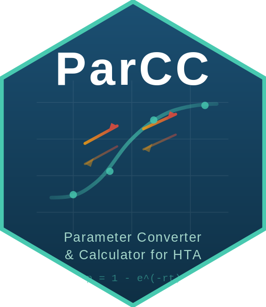

<!-- README.md is generated from README.Rmd. Please edit that file -->

# ParCC: Parameter Converter & Calculator for HTA <a href="https://drpakhare.github.io/ParCC/"></a>

<!-- badges: start -->

[](https://CRAN.R-project.org/package=ParCC)
[](https://lifecycle.r-lib.org/articles/stages.html#stable)

<!-- badges: end -->

**ParCC** is an interactive Shiny application for Health Technology
Assessment (HTA) parameter estimation. It bridges the gap between
clinical evidence and economic models by automating complex parameter
transformations with full formula documentation and literature citations.

**Documentation:** <https://drpakhare.github.io/ParCC/>

## Installation

You can install ParCC from
[GitHub](https://github.com/drpakhare/ParCC) with:

``` r
# install.packages("remotes")
remotes::install_github("drpakhare/ParCC")
```

## Quick Start

``` r
library(ParCC)
run_app()
```

## Key Features

- **Core Conversions** -- Rate to Probability, Odds to Probability,
  Time Rescaling, OR to RR (Zhang & Yu), Effect Size (Chinn).
- **HR Converter** -- HR-to-probability, multi-HR comparison, NNT/NNH
  calculator, Log-rank to HR (Peto).
- **Survival Extrapolation** -- Exponential, Weibull, and Log-Logistic
  fitting from published KM data.
- **Background Mortality** -- SMR adjustment, Gompertz fitting, DEALE,
  linear interpolation.
- **PSA Distributions** -- Beta, Gamma, LogNormal (Method of Moments),
  Dirichlet (multinomial).
- **Economic Evaluation** -- ICER, Net Monetary Benefit, Value-Based
  Pricing (headroom analysis).
- **Budget Impact Analysis** -- 5-year BIA framework with population
  uptake curves and discounting (ISPOR).
- **PPP Currency Converter** -- Purchasing Power Parity conversion
  across 30 countries with WHO-CHOICE WTP thresholds.
- **Global Currency Selector** -- INR, USD, EUR, GBP, JPY, and more;
  all economic modules update automatically.
- **Batch Processing** -- Bulk rate, odds, and HR-based conversions with
  CSV upload/download.
- **Lab Notebook** -- Generates an HTML report with methodology and
  citations for every session.

## What's New in v1.4.0

- Budget Impact Analysis (ISPOR framework)
- PPP Currency Converter with WHO-CHOICE WTP thresholds
- OR-RR and effect size conversions for NMA preparation
- NNT/NNH calculator and Log-rank to HR (Peto)
- Dirichlet distribution for Markov transition matrices
- Log-Logistic survival with non-monotonic hazard support
- Annuity / PV stream calculator
- Interactive clickable tool overview on Home page
- 5 new worked-example vignettes

## Vignettes

After installation, browse the tutorials:

``` r
browseVignettes("ParCC")
```

Or visit the [online
documentation](https://drpakhare.github.io/ParCC/articles/).

## Citation

Regional Resource Centre for HTA, AIIMS Bhopal. (2025). ParCC:
Parameter Converter & Calculator for Health Economic Evaluation (Version
1.4.0) \[R package\]. Available at:
<https://drpakhare.github.io/ParCC/>
